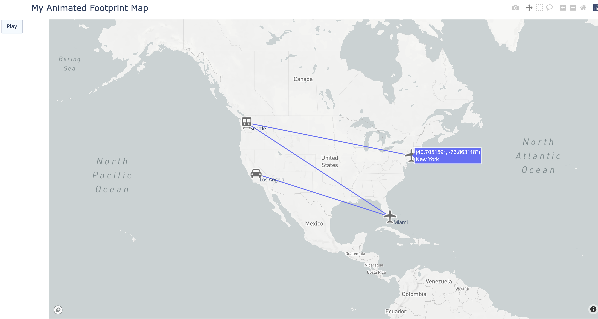
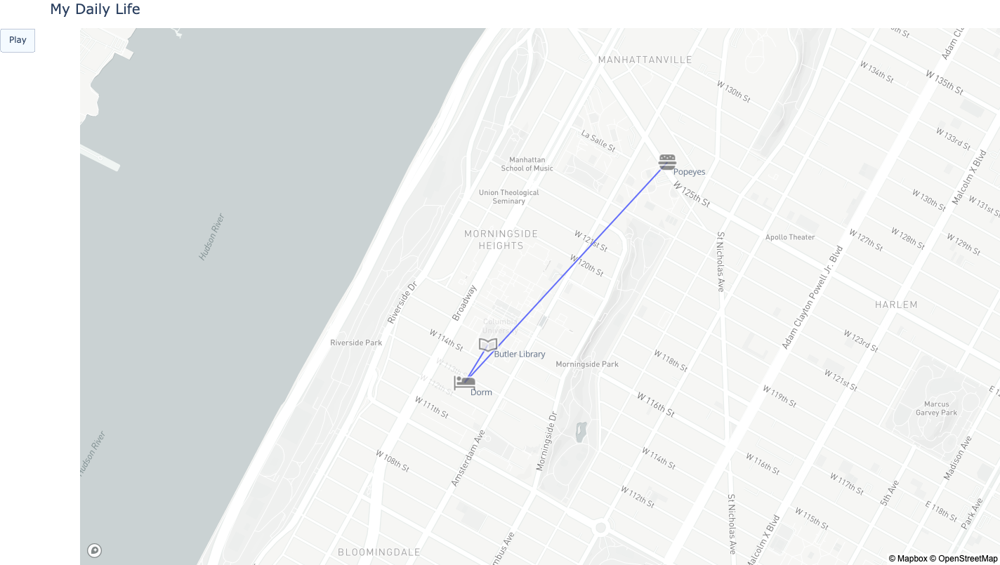
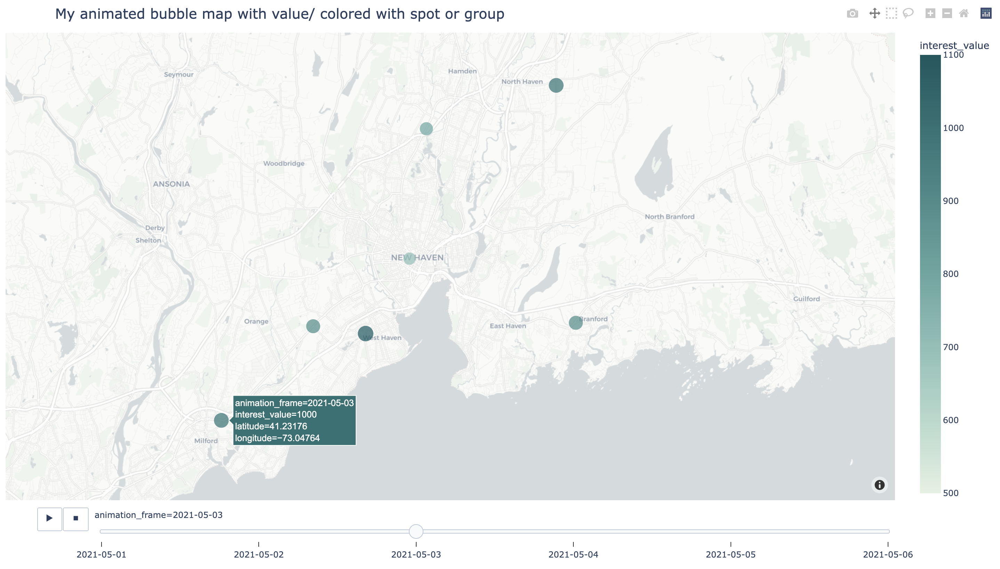
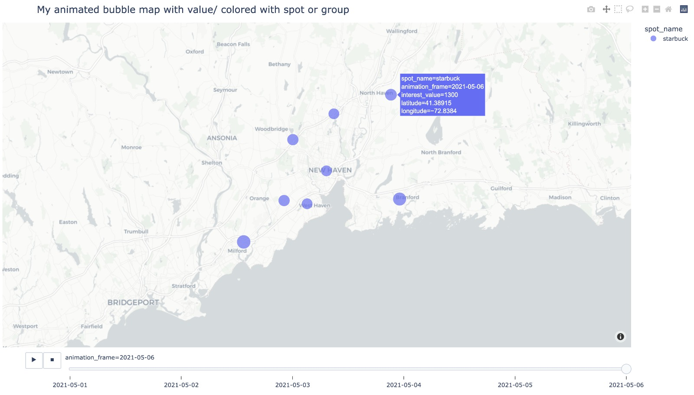

# poivizdynamic

**Animate your point-of-interest map! Make the point-trace/ value-trend moving!**

This package helps users more easily visualize dynamic points/ value change on the map, observing {value amount/ point position} changes dynamically as the time-bar moves forward. 

Users firstly need to prepare the POI dataset following the fake_demo_data format which can be found in the poivizdynamic/data folder. Then they can customize their easy animated maps with functions provided here.

## Installation

Please install and import the censusviz package using the following commands.

```bash
$ pip install poivizdynamic
```
or

```bash
$ pip install -i https://test.pypi.org/simple/ poivizdynamic
```

After installing via pip, please import the package to use on your Python IDE.

```bash
from poivizdynamic import poivizdynamic as pv
```

## Usage

### Prepare Correct Format of Data in Interests

The input csv data should contains the following information (columns):
basic info:
- unique_id: the unique id of the POIs
- spot_name: the name of the POIs	(i.e. Popeyes)
address info:
- street: correct street information of the POIs (i.e. 321 W 125th St)
- city: the city info of the POIs	(i.e.  New York/ NY)
- state: the state info of the POIs   (i.e.  New York/ NY)
- country: the country info of the POIs	
value of interests:
- interest_value: if interest in point move, just leave this blank or 0; 
        if interested in value change, fill it here!
time series info:
- date
icon of POI:
- symbol: choose your icon for your POIs (i.e. airport, rail, car, airport, library, lodging, fast-food)
        more icons' name info can be found here: https://labs.mapbox.com/maki-icons/

The sample csv file "fake_demo_data.csv" can be found in the poivizdynamic/data folder. 

```bash
df = pd.read_csv(<your own data here>)

# demo_data
df = pd.read_csv('.src/poivizdynamic/data/demo_fake_data.csv')
```

### Get Coordination Information For POIs

The ```get_coordinate_api``` function returns a one-line pandans.DataFrame showing coordination information of a POI.

Parameters (required):

- api_key: a private api key
    if maptype = "US":
        pass in the private api key GEO_CENSUS_API_KEY provided by the U.S. Census Bureau. https://www.census.gov/data/developers/data-sets/popest-popproj/popest.html
    if maptype = "wold":
        pass in the private api key GEO_RADAR_API_KEY provided by Radar (Radar is the leading geofencing and location tracking platform). Instruction on how to get the code at Authentication session: https://radar.com/documentation/api

- dataframe : pandans.DataFrame
    This is the input one-line dataframe, which used as the query text for the geo-APIs.
    It should contain the address information for only one POI.

Parameters (optional):

- maptype : {"world", "US"}, default "world", optional
    Geo-API to use. The "US" API returns more accurate result than "world" when specifically looking at places in the US.
    Details provided in the links attached below the api_key description.

This function is also a built-in function of  ```get_geo_dataset``` applying to each row of the dataframe

```bash
get_coordinate_api(api_key = GEO_CENSUS_API_KEY, dataframe, maptype = "US")
get_coordinate_api(api_key = GEO_RADAR_API_KEY, dataframe, maptype = "world")
```

### Return the Final Geoinfo-Dataframe

The ```get_geo_dataset```function returns a whole dataset with geo-information, a pandans.DataFrame combined original information with matched geographical information. 

Parameters:

- api_key: a private api key (pass the api key to the inner function get_coordinate_api(); same help doc of that one).

- dataframe : pandans.DataFrame

    This is the input dataframe, which contains a list of POI's address information.

- maptype : {"world", "US"}, default "world"


The ```clean_dataset``` function prepares the data type in the dataset for animated map ploting usage. It ensures the "date" is date format; "longitude" and "latitude" are numeric format.


Play around with the demo data:

The ```get_demo_data``` function gets the three demo datasets.

```bash
# get_demo_data
travel = pv.get_demo_data(df, "my travel map")

# Two data preparation process
travel = pv.get_geo_dataset(api_key_w, travel)  # default maptype is world
travel = pv.clean_dataset(travel)
```

### Return a Dynamic Points-footprint Map

The ```get_footprint_map``` function returns a dynamic footprint plotly map plot saved as "html" file in the "demo_output" directory. It is a Output plotly dynamic map plot of the POIs' geometric information changing with the date information. 

It can show the tracing line move from one spot (POI) to another spot (POI). (Trace line of the activity is shown.)

This function basically based on the strong dash tool "Plotly": https://plotly.com/, which worth everybody to get a deep research on this amazing pkg!

Parameters:

- TOKEN_MAPBOX: an access token is required by Mapbox in order to get the dynamic plot look nicer.
    Free access for the token: https://docs.mapbox.com/help/getting-started/access-tokens/.
- df_in:  pd.DataFrame
    The dataframe contains the information would be animated and mapped.
- fig_name: str, default "my_animate_map"
    Customize name of saving html file.
- title_text: str, default "My animated map"
    Customize name of the map title.
- title_size: int, default 20
    Customize the font size of the map title.
- zoom: float/ int, default 2.5
    Customize the zoom level of the map plot. 2.5 for country level, 10~20 for city/ street level.


```bash
# footprint map
pv.get_footprint_map(TOKEN_MAPBOX, travel, fig_name = "my foot print", title_text = "My Animated Footprint Map")
```
Get a screenshot of the dynamic result!




```bash
# load and prepare the "life" demo data 
life = pv.get_geo_dataset(api_key_w, life)
life = pv.clean_dataset(life)

# footprint map
pv.get_footprint_map(TOKEN_MAPBOX, life, zoom = 14.5, title_text = "My Daily Life", fig_name = "life")
```




## Return a Dynamic Time-varied Bubble Map

The ```get_animated_bubble_map``` function returns a dynamic bubble plotly map plot saved as "html" file in the "demo_output" directory. Output plotly dynamic bubble map plot of the POIs' geometric information change with the date information. The bubble size and color could be controlled. 

*P.S. More customized parameters are still under exploration due to the time limitation...*

Parameters:

- df: pd.DataFrame
    The dataframe contains the information would be animated and mapped.
- title_text: str, default "My animated map"
    Customize name of the map title.
- title_size: int, default 20
    Customize the font size of the map title.
- color_group_lab: str, default "spot_name"
    This control the color group, which means the color will be group by color_group_lab.
- color_value_discrete: bool, default True
    True: the color value is continuous, so the color bar will be set in a continous form.
    False: the color value is discrete, so the color will be categorical set.
- bubble_size: str -> name of column, or int -> constant - bubble_size; default "interest_value"
    Can be the name of column with dynamic values, and the bubble size will change along with the change of the dynamic values given.
    If the bubble_size input is an instant, the bubble size will remain the same during the whole time-series process shown on the plot.
- radius: int, default 20
    Customize the radius of the bubble.
- zoom: float/ int, default 2.5
    Customize the zoom level of the map plot. 2.5 for country level, 10~20 for city/ street level.
- fig_name: str, default "my_animate_map"
    Customize name of saving html file.


```bash
# load and prepare the "starbuck" demo data 
starb2 = pv.get_geo_dataset(api_key_us, starb, maptype = "US")
starb2 = pv.clean_dataset(starb2)

# bubble map with color_group_lab = YOUR_INTEREST_VALUE
pv.get_animated_bubble_map(TOKEN_MAPBOX, starb2, zoom = 10, color_value_discrete = False, bubble_size = "interest_value", color_group_lab = "interest_value", fig_name = "starbuck2")
```



```bash
# bubble map with color_group_lab = POI'S NAME
pv.get_animated_bubble_map(TOKEN_MAPBOX, starb2, zoom = 10, color_value_discrete = False, bubble_size = "interest_value", color_group_lab = "spot_name", fig_name = "starbuck1")
```



*Detailed Help Document When Using the Functions:*
*Access to the help document using the following lines.*

```bash
?pv.get_coordinate_api
?pv.get_geo_dataset
?pv.clean_dataset

?pv.get_footprint_map
?pv.get_animated_bubble_map

?pv.get_demo_data
```


## Contributing

Interested in contributing? Check out the contributing guidelines. Please note that this project is released with a Code of Conduct. By contributing to this project, you agree to abide by its terms.

## Dependencies

- python = "^3.9"
- pandas = "^1.3.5"
- plotly = "^5.4.0"
- requests = "^2.26.0"
- timer = "^0.2.2"
- datetime = "^4.3"

## Documentation

The unofficial documentation can be found under this relative path: .docs/_build/html/index.html

## License

`poivizdynamic` was created by TianqingZhou. It is licensed under the terms of the MIT license.

## Credits

`poivizdynamic` was created with [`cookiecutter`](https://cookiecutter.readthedocs.io/en/latest/) and the `py-pkgs-cookiecutter` [template](https://github.com/py-pkgs/py-pkgs-cookiecutter).
